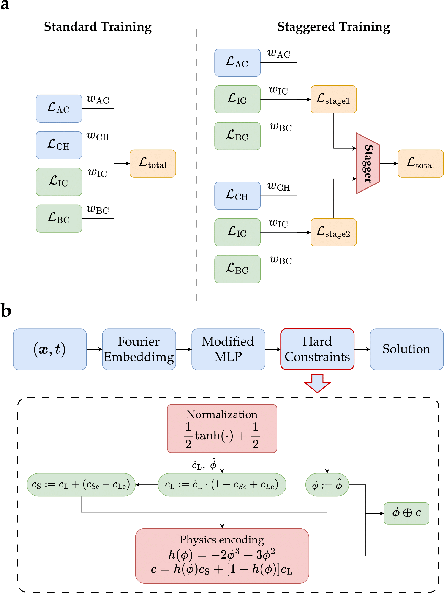
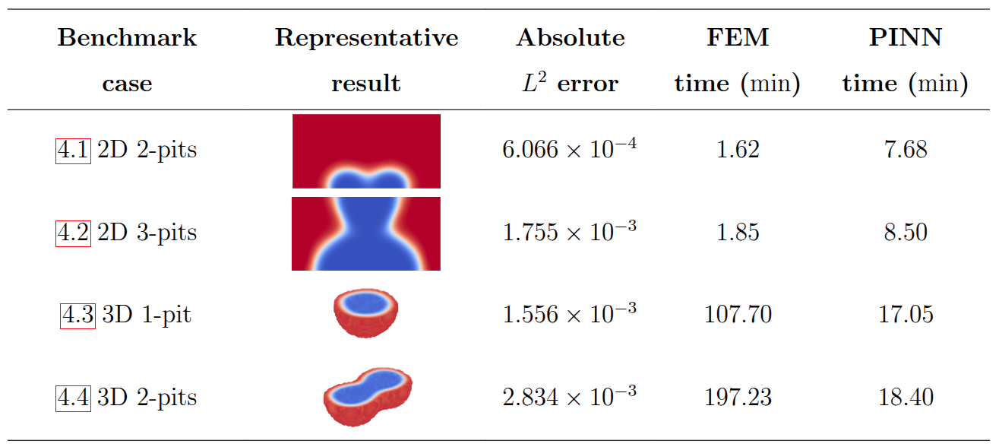

# Sharp-PINNs-JAX


The JAX implementation of [Sharp-PINNs](https://github.com/NanxiiChen/sharp-pinns)


Staggered HARd-constrained Physics-Informed Neural Networks for Phase-field modelling of corrosion

## Overview

This framework features a novel staggered training scheme and an enhanced neural network architecture. Key features of this architecture include leveraging random Fourier features $\mathcal{F}$ as input embeddings, employing a modified MLP $\mathcal{M}$ as the primary backbone, and enforcing hard constraints $\mathcal{H}$ in the output layer. A schematic of the SHARP-PINNs framework is shown below.

### Methodology




### State-of-the-art benchmarks




## Usage

```bash
python examples/corrosion2d2pits/main.py
```


## Citation

```bibtex
@misc{chen2025sharppinnsstaggeredhardconstrainedphysicsinformed,
      title={Sharp-PINNs: staggered hard-constrained physics-informed neural networks for phase field modelling of corrosion}, 
      author={Nanxi Chen and Chuanjie Cui and Rujin Ma and Airong Chen and Sifan Wang},
      year={2025},
      eprint={2502.11942},
      archivePrefix={arXiv},
      primaryClass={cs.LG},
      url={https://arxiv.org/abs/2502.11942}, 
}
```
